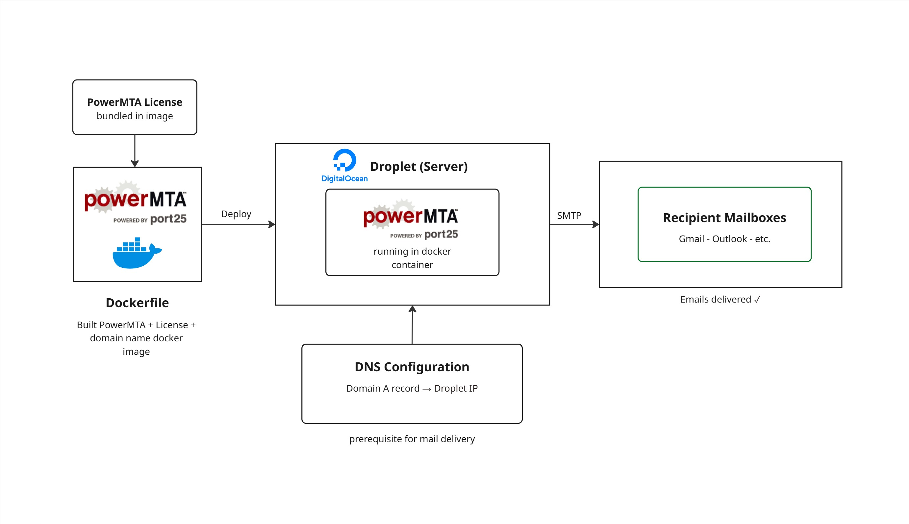

# PowerMTA Deployment on DigitalOcean


## Overview

Dockerized the PowerMTA mail transfer application with a licensed configuration and deployed it on a DigitalOcean Droplet. Configured domain DNS records and PowerMTA settings to enable production email delivery, validated end-to-end by demonstrating successful email delivery to live mailboxes.

## Architecture



The deployment flow:
- **Dockerfile** packages PowerMTA with license and entrypoint configuration
- **Docker image** deployed on a DigitalOcean Droplet server
- **Domain DNS** configured to point to the Droplet IP
- **PowerMTA** handles outbound mail delivery from the server

## Tech Stack

| Layer | Technology |
|-------|-----------|
| Containerisation | Docker |
| Server | DigitalOcean Droplet |
| Application | PowerMTA (licensed) |
| Mail protocol | SMTP |
| DNS | Domain A record → Droplet IP |

## What Was Built

**1. Dockerized PowerMTA with license**
- Wrote a `Dockerfile` packaging PowerMTA with the client's license file
- Configured entrypoints and startup scripts inside the container
- Ensured the license was loaded correctly on container start

**2. Deployed on DigitalOcean Droplet**
- Pulled and ran the Docker image on a DigitalOcean Droplet
- Configured the server environment for outbound mail delivery

**3. Domain and DNS configuration**
- Added the Droplet's IP address to the domain DNS records
- Configured PowerMTA with the client's domain for mail sending

**4. Email delivery demo**
- Demonstrated end-to-end email delivery to live mailboxes
- Validated that emails were sent and received successfully

## Project Structure

```
06-powerMTA-DEVOPS/
├── Dockerfile          (PowerMTA + license + entrypoint)
├── config/
│   └── powermta.conf   (PowerMTA configuration)
└── README.md
```

## Key Learnings

- Packaging licensed applications inside Docker containers securely
- Configuring PowerMTA for outbound email delivery in a containerised environment
- DNS record configuration for mail server domain alignment